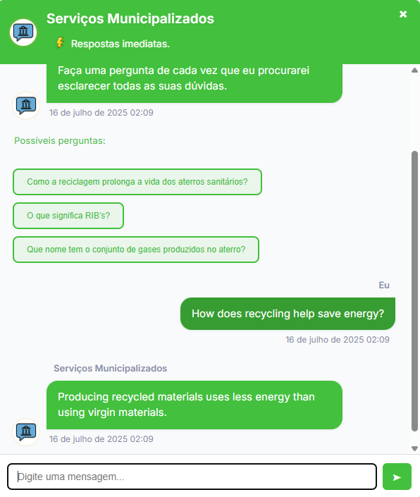

# Assistente Inteligente com FAISS e Embeddings

Este projeto implementa um chatbot inteligente que responde a perguntas usando **matching semântico com FAISS** e **Sentence Transformers**. O sistema organiza perguntas/respostas por categorias e suporta multilinguagem (PT/EN).

## Como executar

### 1. Instalar dependências

```bash
pip install -r requirements.txt
```

### 2. Construir os índices FAISS

Coloca os ficheiros `faq_*.txt` na pasta `faq/`, seguindo este formato:

```
P: Como matricular o meu filho?
R: Deve dirigir-se à escola com os documentos necessários.

P: Que apoios sociais existem?
R: Pode consultar a linha de apoio à ação social.
```

Depois corre:

```bash
python Faiss_index.py
```

Isso irá gerar os ficheiros `.index` e `*_qa.txt` na pasta `faiss_indexes/`.

### 3. Executar o chatbot com FAISS

```bash
python FAISgrouped.py
```

### 4. Ou usar a versão sem embeddings

```bash
python chatbot.py
```

> Esta versão usa correspondência por palavras-chave e ficheiros como `bots/nomebot/cultura_qa_pt.txt`.

## Exemplo de pergunta

```
Você: Onde posso inscrever meu filho na escola?
Bot (categoria: educacao):
  (distância 0.3982) → Deve dirigir-se à escola com os documentos necessários.
```
## Imagens do sistema

### 1. Interface do chatbot (PT)

Legenda: Interface principal do chatbot em português.

### 2. Interface do chatbot (EN)

Legenda: Interface principal do chatbot em inglês.

### 3. Dashboard de métricas

Legenda: Painel de desempenho com métricas detalhadas do chatbot e feedback dos cidadãos.

### 4. Backoffice do bot

Legenda: Painel de gestão do bot com seleção de fontes de conhecimento.

### 5. Fluxo de funcionamento - parte 1

Legenda: Primeira parte do fluxo do chatbot: identificação e categorização.

### 6. Fluxo de funcionamento - parte 2

Legenda: Segunda parte do fluxo do chatbot: seleção e envio da resposta.

## Notas

- Os ficheiros `*_qa.txt` devem ter o formato `pergunta\tresposta` (tabulação).
- Os ficheiros FAQ devem seguir o padrão `P:` e `R:`.